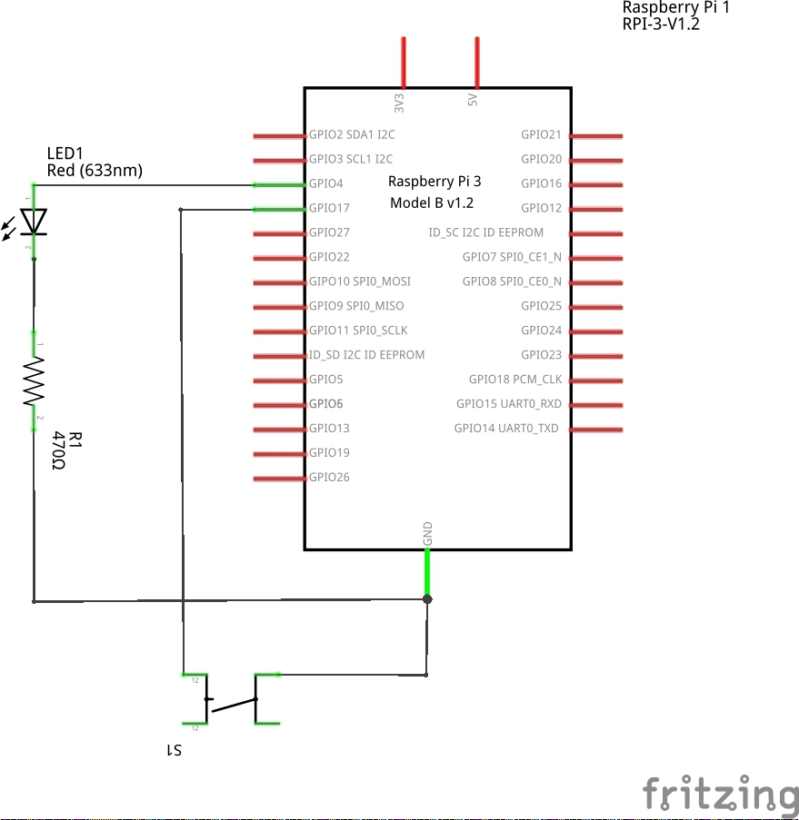

# Introdução
No artigo anterior foi descrito o que era IPC e quais eram os seus tipos, neste artigo será descrito
a implementação e instalação da biblioteca responsável por controlar as aplicações que são baseadas 
no famoso acionamento de um LED através de um botão, esta biblioteca foi criada através de três dos quatros pilares do paradigma de programação orientação a objetos que é a abstração, encapsulamento e herança. Para execução das aplicações serão feitas na plataforma Raspberry Pi 3 e a compilação da biblioteca tanto das aplicações serão feitas utilizando o CMake.

# Raspberry Pi 3 B+

A Raspberry Pi 3 Model B+ Anatel é um mini-PC que roda distribuições Linux como o Raspbian e Ubuntu, mas também suporta outros sistemas operacionais como o Windows 10 IoT e versões customizadas do Linux.

A versão B+ da Raspberry Pi 3 tem processador de 1.4GHz, 1GB de memória e agora suporta redes wireless no padrão AC, proporcionando muito mais velocidade para a sua conexão e melhorando a performance da placa. Essas especificações, aliadas à outras melhorias no conjunto do hardware, fazem com que essa placa tenha uma performance 17% maior em comparação ao modelo anterior.
### Especificação

<ul>
  <li>Raspberry Pi 3 Model B+ Anatel</li>
  <li>Processador Broadcom BCM2837B0 64bits ARM Cortex-A53 Quad-Core</li>
  <li>Clock 1.4 GHz</li>
  <li>Memória RAM: 1GB</li>
  <li>Adaptador Wifi 802.11 b/g/n/AC 2.4GHz e 5GHz integrado</li>
  <li>Bluetooth 4.2 BLE integrado</li>
  <li>4 portas USB 2.0</li>
  <li>Conector Gigabit Ethernet over USB 2.0 (throughput máximo de 300 Mbps)</li>
  <li>Alimentação: 5V 3A (Recomendado)</li>
  <li>Interface para câmera (CSI)</li>
  <li>Interface para display (DSI)</li>
  <li>Slot para cartão microSD</li>
  <li>Conector de áudio e vídeo</li>
  <li>GPIO de 40 pinos</li>
  <li>Certificado de homologação Anatel: 01598-18-10629</li>
  <li>Dimensões: 85 x 56 x 17mm</li>
</ul>


# CMake
CMake é uma ferramenta open source desenvolvida para compilar, gerar testes e construir
pacotes para distribuir as aplicações em forma de .rpm ou .deb

# Preparando o ambiente
Para o desenvolvimento dos passos a seguir é necessário ter a Raspberry Pi conectada na internet.
Acesse a Raspberry via commando ssh ou se estiver conectada em um monitor abra um terminal,
durante o desenvolvimento dos exemplos foi utilizado o acesso via ssh.

Acesse o target:

```bash
$ ssh pi@{raspberry_ip}
```

Exemplo: 

```bash
$ ssh pi@192.168.0.2
```

Atualize os repositorios e instale o cmake:

```bash
$ sudo apt-get update
$ sudo apt-get install cmake
```

Faça o download do repositorio no link:

```bash
$ cd
$ git clone [github](https://github.com/NakedSolidSnake/articles)
```


Acesse o diretorio libs para compilar e instalar a biblioteca responsavel por controlar o botão e LED das aplicações:

```bash
$ cd articles/libs
```

No diretório raiz crie uma pasta chamada build onde irá ficar os arquivos gerados pelo cmake e execute o comando do cmake gerar os arquivos para a compilação:

```bash
$ mkdir build && cd build
$ cmake ..
```


Uma vez que os arquivos foram gerados execute o comando make

```bash
$ make
```

Irá ser gerado um diretorio bin onde os binarios da aplicação são salvos e um diretorio lib onde as bibliotecas ficam salvas.\newline

Agora instale a lib gerada.

```bash
$ sudo make install
```

Com o setup concluído, será apresentado a implementação da lib hardware.

# Implementação da lib hardware
## Headers
Para a implementação da lib hardware foi utilizado a API wiringPi que provê uma abstração do hardware da Raspberry Pi, dessa forma facilitando o desenvolvimento. Para saber mais sobre a API acesse  [wiringpi](http://wiringpi.com/)

A seguir é possível visualizar a implementação do header GPIO.h


```c
#ifndef __GPIO_H
#define __GPIO_H

typedef enum
{
    eModeInput = 0,
    eModeOutput
}eMode_t;

typedef enum
{
    eStateLow = 0,
    eStateHigh
}eState_t;

typedef struct 
{
    int pin;
    eMode_t eMode;
}GPIO_t;

/**
 * @brief 
 * 
 * @param gpio 
 * @return int 
 */
int GPIO_init(GPIO_t *gpio);

#endif
```

Entre as linhas 5 até 9 tem a definição de uma enumeração que representa o modo em qual o gpio vai ser utilizado com dois estados possíveis: entrada ou saída.

Entre as linhas 11 até 15 tem a definição de uma enumeração que representa o estado do GPIO se está em nível baixo ou nível alto.

Entre as linhas 17 até 21 tem a definição do tipo GPIO_t onde contém os atributos pin que recebe o número do GPIO a ser configurado e eMode que representa em qual modo ele vai ser utilizado.

Na linha 29 tem a função de inicialização do GPIO.

A seguir é possível visualizar a implementação do header LED.h.

```c
#ifndef __LED_H
#define __LED_H

#include <gpio.h>

typedef struct
{
    GPIO_t gpio;    /**!< Herda Gpio */
}LED_t;

/**
 * @brief 
 * 
 * @param led 
 * @return int 
 */
int LED_init(LED_t *led);

/**
 * @brief 
 * 
 * @param led 
 * @param eState 
 * @return int 
 */
int LED_set(LED_t *led, eState_t eState);

#endif
```

Na linha 4 é adicionado o gpio.h, nesse caso serve para o LED herde as caracteristicas de 
GPIO.

Entre as linhas 6 até 9 tem a definição da estrutura de LED onde o unico atributo é a estrutura do GPIO, colocando o tipo GPIO como primeiro atributo da estrutura LED garante que em memória o tipo LED_t e GPIO_t tenham o mesmo endereço de memória assim utilizando o cast para GPIO_t 
é possível acessar os atributos de GPIO, isso será demonstrado na implementação em sources, mas isso caracteriza a herança do paradigma de programação orientado a objetos.

Na linha 26 tem a função responsável por alterar o estado do LED conforme seu parâmetro eState.

A seguir é possível visualizar a implementação do header Button.h

```c
#ifndef __BUTTON_H
#define __BUTTON_H

#include <gpio.h>

typedef void (*button_cb)(void);

typedef enum
{
    ePullModePullOff = 0,
    ePullModePullDown,
    ePullModePullUp
}ePullMode_t;

typedef enum
{
    eIntEdgeSetup = 0,
    eIntEdgeFalling,
    eIntEdgeRising,
    eIntEdgeBoth
}eIntEdge_t;

typedef struct
{
    GPIO_t gpio;
    ePullMode_t ePullMode;
    eIntEdge_t eIntEdge;
    button_cb cb;
}Button_t;

/**
 * @brief 
 * 
 * @param button 
 * @return int 
 */
int Button_init(Button_t *button);

/**
 * @brief 
 * 
 * @param button 
 * @return int 
 */
int Button_read(Button_t *button);

#endif

```

Na linha 5 é adicionado o gpio.h, nesse caso serve para o Button herde as caracteristicas de GPIO.

Na linha 7 é criado um tipo para ponteiro de função onde seu retorno é void e sem parâmetros de entrada, esse tipo serve para poder configurar o callback caso o botão seja configurado para poder gerar interrupções.

Entre as linhas 9 até 14 tem a definição de uma enumeração que representa como o pull será configurado, se for com resistor externo deve-se configurar como desligado.

Entre as linhas 16 até 22 tem a definição de uma enumeração que representa em que momento vai ser invocada a função de callback.

Entre as linhas 24 até 30 tem a definição Button e como o LED herda a estrutura GPIO e neste caso cria novos atributos pertinentes a sua estrutura.

Na linha 38 possui a função que permite inicializar o Button.

Na linha 46 é possui a função que retorna o estado do botão.

## Sources

Nesta seção é possível entender como foi feita a implementação e o conceito de herança utilizado.

```c
#include <gpio.h>
#include <stdlib.h>
#include <wiringPi.h>

int GPIO_init(GPIO_t *gpio)
{
    if(!gpio)
        return EXIT_FAILURE;

    wiringPiSetup();
    pinMode(gpio->pin, gpio->eMode);

    return EXIT_SUCCESS;
}
```

Na linha 5 pode-se ver a implementação de gpio sem muita complexidade, na linha 10 é possível ver a inicialização da API que quando chamada nesse formato mapeia os pinos para o modo schema onde são numerados de 0 à 16.

```c
#include <led.h>
#include <stdio.h>
#include <stdlib.h>
#include <wiringPi.h>

int LED_init(LED_t *led)
{
    if(!led)
        return EXIT_FAILURE;

    return GPIO_init((GPIO_t *)led);    
}

int LED_set(LED_t *led, eState_t eState)
{
    if(!led)
        return EXIT_FAILURE;

    digitalWrite(((GPIO_t *)led)->pin, eState);

    return EXIT_SUCCESS;
}
```

Na linha 11 pode-se ver como é passado o parametro para GPIO_init, fazendo _casting_ para o tipo (GPIO_t *) a estrutura LED passa a ser GPIO devido ter as mesma referências em memória.

```c
#include <button.h>
#include <stdio.h>
#include <stdlib.h>

int Button_init(Button_t *button)
{
    if(!button)
        return EXIT_FAILURE;

    GPIO_init((GPIO_t *)&button);
      
    pullUpDnControl(((GPIO_t *)button)->pin, button->ePullMode);
    if(button->cb)
        wiringPiISR(((GPIO_t *)button)->pin, button->eIntEdge, button->cb);


    return EXIT_SUCCESS;
}

int Button_read(Button_t *button)
{
    if(!button)
        return EXIT_FAILURE;

    return digitalRead(((GPIO_t *)button)->pin);
}
```


Aqui acontece o mesmo que em led.c, essa é uma forma de se obter a herança em C.

# Testando a instalação e as conexões de hardware

A conexão dos componentes é bem simples demonstrado na figura a seguir:





Uma vez montado o circuito agora é só testar para ver se está tudo funcionamento conforme o esperado, para isso acesse a pasta bin/tests:

```bash
$ cd bin/tests
```

Execute a aplicação test_test, e assim que pressionar o botão o LED deve mudar de estado.

```bash
$ ./test_test
```


# Conclusão
Neste artigo foi apresentado como se configura o ambiente, verificação de como o código fonte foi implementado, de uma forma simples mas sofisticada, para não dizer cheio de flores, e também como conectar os componentes aos gpio's do Raspberry Pi 3 B+, e por fim como testar para verificar se a configuração foi executada corretamente.
No próximo artigo vem o primeiro IPC, visando que esses passos são pré requisito para os próximos artigos.
